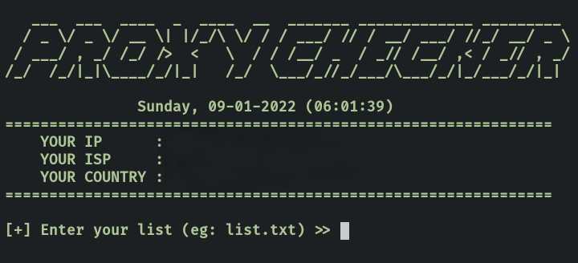

# Proxy Checker
Proxy validation or Proxy checker

## Install on desktop : 
- Install XAMPP
- Added environment variable system path => C:\xampp\php
- download the script and save it in your folder
- open CMD and running

## Install on android (Termux)
    $ pkg install git -y
    $ pkg install php -y
    $ git clone https://github.com/Zlaxtert/proxy-checker
    $ cd proxy-checker
    $ php proxy.php

## Screenshot

## Note
Results saved in folder 'result'

